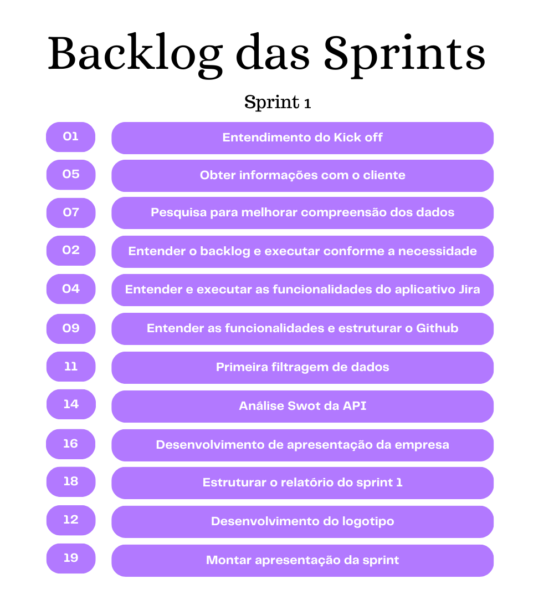

[+À+SWIFT+MOVE!;ESTAMOS+FELIZES+EM+TER+VOCÊ+AQUI!)](https://git.io/typing-svg)

# Quem somos?
*Moving at the speed of the future!  |  Movendo-se na velocidade do futuro!*

Bem-vindo(a)  a SWIFT MOVE, onde o futuro da mobilidade se torna uma realidade palpável. Somos uma empresa logística dedicada em fornecer praticidade, inovação e habilidade ágil e sob medida de acordo com as necessidades individuais de cada cliente. Temos um compromisso inabalável com a excelência e nos destacamos no mercado com planejamento preciso e efetivo. Nossa missão é impulsionar o futuro da movimentação de maneira rápida, eficiente e segura. 

Com uma equipe de ponta e tecnologia avançada, a SWIFT MOVE está comprometida em simplificar o processo logístico e garantir um resultado excepcional ao cliente.

>Logo

      

>Organograma

      

>Análise SWOT- API

      

# Índice

* [Projeto](#projeto-template)
* [Equipe](#equipe)
* [Objetivo do Projeto](#objetivo-do-projeto)
* [Sprints](#Sprints)
* [Burndown](#Burndown)
* [Backlog do produto](#Backlog-do-produto)

# Projeto (API) 
Projeto baseado na metodologia ágil SCRUM (método aliado dos gestores de projetos), procurando desenvolver a Proatividade, Autonomia, Colaboração e Entrega de Resultados dos estudantes envolvidos.

# Equipe
|    Função     | Nome                                  |                                                                                                                                                      LinkedIn & GitHub                                                                                                                                                      |
| :-----------: | :------------------------------------ | :-------------------------------------------------------------------------------------------------------------------------------------------------------------------------------------------------------------------------------------------------------------------------------------------------------------------------: |
| Product Owner |   Jennifer Senne         |                    |
| Scrum Master  | Stela Lúcio |            |
| Team Member   | Ana Clara              |         )         |
|  Team Member  | Isabela Lopes                 |                  |
|  Team Member  | Pedro Martins                 |       |
|  Team Member  | Rafael Cesar      |                      |
|  Team Member  | Reinaldo Mariano       |                      |

# Objetivo do Projeto
Este projeto tem como objetivo mapear e produzir um fluxo de exportações a partir dos dados da RMVALE e LITORAL NORTE através do aeroporto Professor Ernesto Stumpf, visando:
* Detalhar cargas potenciais;
* Cargas com valor agregado relevante;
* Otimização de tempo logístico;
* Analisar as oportuninades aeroviárias;
* Desenvolvimento de uma ferramenta visual, com dados que auxiliem tomadas de decisões.
 

## Tecnologias Utilizadas

      

# Sprints

Sprint | Previsão | Status| Histórico| Apresentação|
|------|--------|------|--------|---------|
|Kick Off | 11/03/2024 | Concluido| [Ver Relatório](Arquivos_Sprint1/Relatório_do_Kick_off.pdf) | - |
|01 | 15/04/2024 | Concluído| [Ver Relatório](Arquivos_Sprint1/relatório_api_sprint1.pdf) | [Ver Apresentação](https://www.canva.com/design/DAGChZ96uKU/psSNBx8S-B0kFeh562fmtg/edit?utm_content=DAGChZ96uKU&utm_campaign=designshare&utm_medium=link2&utm_source=sharebutton)
|02|  06/05/2024|Em progresso |  -  | - |
|03| 27/05/2024 | A fazer|  -  | - |
|04| 17/06/2024 | A fazer |  -  | - |
|Feira de Soluções|27/06/2024 | A fazer |  -  | - |
  
# Backlog

 > Backlog do produto

      

  > Backlog das Sprints

      

## Sprint 1. Concepção
- [X] Entender como funciona o backlog e executar conforme a necessidade;
- [X] Entender e executar as funcionalidades do aplicativo Jira;
- [X] Entender as funcionalidades e estruturar o Github;
- [X] Estruturar o relatório da sprint 1;
- [X] Montar apresentação da sprint.

## Sprint 2. Desenvolvimento do Projeto
- [ ] Iniciar a estrutura do Power BI
- [ ] Pesquisar e analisar a capacidade de carga;
- [ ] Filtragem e identificação de produtos promissores;
- [ ] Classificar produtos por valor agreagado;
- [ ] Atualização dos softwares;
- [ ] Estruturar o relatório da sprint 2.
      
## Sprint 3 . Implementação
- [ ] Capturar e análisar dados;
- [ ] Aprimoramento do Dashboard;
- [ ] Teste das atualizações;
- [ ] Atualização dos softwares;
- [ ] Estrutura do relatório sprint 3.
     
## Sprint 4. Operacionalização
- [ ] Finalização e entrega do dashboard;
- [ ] Revisar dados e softwares;
- [ ] Iniciar preparativos para a feira de soluções;
- [ ] Preparação para a apresentação final;
- [ ] Estruturar relatório final.

# Burndown

> Burndown 1

      

